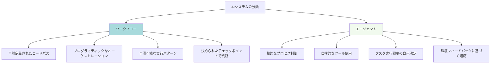

# 効果的なAIエージェントの構築：Anthropicのベストプラクティスガイド

## はじめに

AIエージェント開発は急速に進化していますが、実際のプロダクション環境では「どのようなアーキテクチャを選択すべきか」という問いが常に付きまといます。Anthropicは、顧客との協業と自社での開発経験から得られた知見をまとめ、効果的なAIエージェントを構築するための実践的なガイドラインを公開しました。

本記事では、Anthropicが提唱する**ワークフロー vs エージェント**の概念、5つの基本的なワークフローパターン、そしてベストプラクティスについて詳しく解説します。

## ワークフローとエージェントの違い

Anthropicは、AIシステムを**ワークフロー**と**エージェント**の2つのカテゴリーに分類しています。

### 定義

**ワークフロー（Workflows）**
- LLMとツールが**事前定義されたコードパス**を通じてオーケストレーションされる
- 実行パターンが予測可能
- 定義されたチェックポイントでインテリジェントな意思決定を行う

**エージェント（Agents）**
- LLMが**動的に**自身のプロセスとツール使用を指示
- タスク実行戦略を自律的にコントロール
- 初期タスクの明確化後、独立して動作
- 環境フィードバックを使って進捗を評価し、アプローチを適応

## 基本構成要素：Augmented LLM

すべてのエージェントシステムの基礎となるのは、**拡張されたLLM（Augmented LLM）**です。

```mermaid
graph LR
    A[基本的なLLM] --> B{拡張機能の追加}

    B --> C[リトリーバル<br/>Retrieval]
    B --> D[ツール<br/>Tools]
    B --> E[メモリ<br/>Memory]

    C --> F[Augmented LLM]
    D --> F
    E --> F

    F --> G[より高度な<br/>ワークフロー/エージェント]

    style A fill:#e9ecef
    style F fill:#457b9d
    style G fill:#1d3557
```

この拡張されたLLMに以下の機能を追加することで、より強力なシステムを構築できます：

- **リトリーバル（検索）**: 外部の知識ベースやドキュメントへのアクセス
- **ツール**: API呼び出し、計算、データベースクエリなどの実行能力
- **メモリ**: 過去のインタラクションやコンテキストの保持

## 5つのワークフローパターン

Anthropicは、プロダクション対応のエージェントシステムの基礎となる5つのコアワークフローパターンを定義しています。

### 1. プロンプトチェイニング（Prompt Chaining）

タスクを一連のステップに分解し、各LLM呼び出しが前のステップの出力を処理します。

**特徴**
- タスクを固定されたサブタスクに明確に分解できる場合に最適
- レイテンシとのトレードオフで精度を向上
- 各ステップの出力を検証・ログ記録可能

**使用例**
- 文書の要約 → 翻訳 → 校正のパイプライン
- データ抽出 → 変換 → 検証のワークフロー

### 2. ルーティング（Routing）

入力を分類し、専門化されたフォローアップタスクに振り分けます。

```mermaid
graph TD
    A[入力] --> B{分類器<br/>LLM}

    B -->|カテゴリA| C[専門LLM A<br/>例：技術サポート]
    B -->|カテゴリB| D[専門LLM B<br/>例：請求関連]
    B -->|カテゴリC| E[専門LLM C<br/>例：一般質問]

    C --> F[出力]
    D --> F
    E --> F

    style A fill:#e9ecef
    style B fill:#f1faee
    style C fill:#a8dadc
    style D fill:#a8dadc
    style E fill:#a8dadc
    style F fill:#1d3557
```

**特徴**
- 異なるタイプの入力に対して専門化されたハンドリング
- カスタマーサポート、コンテンツモデレーションなどに有効

**使用例**
- カスタマーサポートチケットの自動振り分け
- コンテンツタイプ別の処理パイプライン選択

### 3. 並列化（Parallelization）

複数のLLM呼び出しを同時に実行します。

```mermaid
graph TD
    A[入力タスク] --> B{タスク分割}

    B --> C[LLM 1<br/>サブタスク1]
    B --> D[LLM 2<br/>サブタスク2]
    B --> E[LLM 3<br/>サブタスク3]
    B --> F[LLM 4<br/>サブタスク4]

    C --> G{統合/投票}
    D --> G
    E --> G
    F --> G

    G --> H[最終出力]

    style A fill:#e9ecef
    style B fill:#f1faee
    style C fill:#a8dadc
    style D fill:#a8dadc
    style E fill:#a8dadc
    style F fill:#a8dadc
    style G fill:#457b9d
    style H fill:#1d3557
```

**2つのアプローチ**

**セクショニング（Sectioning）**
- タスクを独立したサブタスクに分割
- 各サブタスクを並列処理
- 結果を統合

**投票（Voting）**
- 同じタスクに対して複数の異なる応答を生成
- 投票メカニズムで最適な回答を選択
- 多様性と信頼性を向上

**使用例**
- 長文ドキュメントの並列要約
- コード生成における複数候補の評価

### 4. オーケストレーター・ワーカー（Orchestrator-Workers）

中央のLLMが動的にタスクを分解し、ワーカーLLMに委譲して、結果を統合します。

```mermaid
graph TD
    A[複雑なタスク] --> B[オーケストレーター LLM]

    B --> C{動的タスク分解}

    C --> D[ワーカー 1]
    C --> E[ワーカー 2]
    C --> F[ワーカー 3]

    D --> G[結果収集]
    E --> G
    F --> G

    G --> B
    B --> H{タスク完了?}

    H -->|No| C
    H -->|Yes| I[統合された最終結果]

    style A fill:#e9ecef
    style B fill:#f1faee
    style C fill:#457b9d
    style D fill:#a8dadc
    style E fill:#a8dadc
    style F fill:#a8dadc
    style G fill:#457b9d
    style H fill:#f1faee
    style I fill:#1d3557
```

**特徴**
- 必要なサブタスクを予測できない複雑なタスクに適している
- オーケストレーターが全体的な戦略を管理
- ワーカーが専門的なサブタスクを実行

**使用例**
- 複雑なリサーチタスク（調査 → 分析 → レポート作成）
- マルチステップのコード生成とリファクタリング

### 5. 評価者・最適化者（Evaluator-Optimizer）

1つのLLMが応答を生成し、別のLLMが評価してフィードバックを提供する反復ループ。

```mermaid
graph TD
    A[初期タスク] --> B[ジェネレーター LLM]

    B --> C[応答生成]
    C --> D[評価者 LLM]

    D --> E{品質基準を<br/>満たしているか?}

    E -->|No| F[改善フィードバック]
    F --> B

    E -->|Yes| G[最終出力]

    H[反復カウンター] --> E
    E -->|最大反復数到達| G

    style A fill:#e9ecef
    style B fill:#a8dadc
    style C fill:#f1faee
    style D fill:#457b9d
    style E fill:#f1faee
    style F fill:#ffb703
    style G fill:#1d3557
    style H fill:#e9ecef
```

**特徴**
- 反復的な改善プロセス
- 明確な品質基準に基づく評価
- 無限ループ防止のための反復制限が必要

**使用例**
- コード生成とレビュー
- 文章の下書き → 編集 → 校正サイクル
- デザインの生成と評価

## ベストプラクティス：3つの原則

Anthropicは、効果的なエージェントを構築するための3つのコア原則を提唱しています。

### 1. シンプルさ（Simplicity）

```mermaid
graph TD
    A[新しいタスク] --> B{直接LLM APIで<br/>解決できるか?}

    B -->|Yes| C[シンプルなLLM呼び出し]
    B -->|No| D{単純なワークフローで<br/>解決できるか?}

    D -->|Yes| E[プロンプトチェイニング<br/>またはルーティング]
    D -->|No| F{複雑なワークフローで<br/>解決できるか?}

    F -->|Yes| G[オーケストレーター・ワーカー<br/>または並列化]
    F -->|No| H[自律エージェント]

    style A fill:#e9ecef
    style B fill:#f1faee
    style C fill:#06d6a0
    style D fill:#f1faee
    style E fill:#a8dadc
    style F fill:#f1faee
    style G fill:#457b9d
    style H fill:#1d3557
```

**原則**
- **最もシンプルなソリューションから始める**
- 小さく始めて、モジュール式に構築
- 明確にパフォーマンスや柔軟性が向上する場合のみ複雑さを導入
- エージェントシステムを構築しないという選択肢も含める

**実践のヒント**
- 多くのパターンは数行のコードで実装可能
- フレームワークは必要性が明確になってから導入
- 実世界のユースケースの90%はシンプルなワークフローで解決可能

### 2. 透明性（Transparency）

**重要な要素**
- 推論プロセスを可視化
- エージェントの計画と意思決定を確認可能にする
- デバッグとユーザー信頼のために解釈可能性を向上

**実装方法**
- ステップごとのログ記録
- 意思決定の根拠を出力
- 中間結果の検証ポイント設置

### 3. 信頼性の高いツールインタラクション

**設計原則**
- ツールは明確にスコープを定義
- 詳細なドキュメンテーション
- 十分なテスト
- エージェントが実世界環境で一貫して動作できるように

**ツール設計のベストプラクティス**
- 明確な入力/出力仕様
- エラーハンドリングの標準化
- 冪等性の保証（可能な場合）
- レート制限とタイムアウトの適切な設定

## いつワークフローを使い、いつエージェントを使うべきか

```mermaid
graph TD
    A[AIシステムの選択] --> B{タスクの性質は?}

    B -->|予測可能で<br/>構造化されている| C{必要なステップ数は?}
    B -->|オープンエンドで<br/>予測困難| D{信頼レベルは?}

    C -->|1-2ステップ| E[直接LLM呼び出し]
    C -->|3-5ステップ<br/>固定フロー| F[ワークフロー<br/>プロンプトチェイニング/ルーティング]
    C -->|多数のステップ<br/>動的フロー| G[複雑なワークフロー<br/>オーケストレーター・ワーカー]

    D -->|高い信頼性が必要| H[エージェント<br/>自律的意思決定]
    D -->|低い| I[ハイブリッド<br/>ワークフロー+制限付きエージェント]

    J{ボリュームとコストは?} --> K[高ボリューム<br/>コスト重視]
    J --> L[低ボリューム<br/>高価値]

    K --> F
    L --> H

    style E fill:#06d6a0
    style F fill:#a8dadc
    style G fill:#457b9d
    style H fill:#1d3557
    style I fill:#f1faee
```

### ワークフローを選択すべき場合

✅ **タスクを固定されたステップに分解できる**
- 明確な開始点と終了点がある
- 実行パスが予測可能

✅ **コスト効率が重要**
- 高ボリュームのタスク処理
- 予測可能なリソース消費

✅ **予測可能性と制御が必要**
- レイテンシの上限が決まっている
- コンプライアンスや規制要件がある

### エージェントを選択すべき場合

✅ **オープンエンドな問題**
- 必要なステップ数を予測できない
- 固定パスをハードコードできない

✅ **文脈依存の判断が必要**
- 微妙な判断や文脈に敏感な決定
- 行ったり来たりする推論が必要

✅ **高価値・低ボリュームの意思決定**
- エージェントの実行コストは高いが、誤った意思決定のコストはさらに高い
- 信頼できる環境でのタスクスケーリング

### ハイブリッドアプローチ

実際のほとんどのAIシステムは混合型です：

- **予測可能な部分にはワークフローを使用**
- **予測不可能な探索にはエージェントを使用**
- プロダクション環境では、巧妙さよりも**回復力**が報われる

## コストの考慮事項

Anthropicの調査によると、トークン消費には大きな違いがあります：

**コスト最適化のヒント**
- 必要最小限の複雑さから始める
- ワークフローパターンを優先的に検討
- エージェントは明確なROIがある場合のみ使用
- キャッシングやプロンプト最適化を活用

## まとめ

Anthropicのガイドラインは、効果的なAIエージェント構築のための実践的なロードマップを提供しています。

**重要なポイント**

1. **段階的なアプローチ**
   - シンプルなLLM APIから始める
   - 必要に応じてワークフローパターンを追加
   - 明確な利益がある場合のみエージェントに移行

2. **パターンの理解**
   - 5つのワークフローパターンを理解する
   - それぞれの強みと制限を把握
   - 適切なパターンを選択

3. **3つの原則**
   - シンプルさを優先
   - 透明性を確保
   - 信頼性の高いツールを構築

4. **コストと価値のバランス**
   - トークン消費を考慮
   - ビジネス価値とのトレードオフを評価
   - 適切なアーキテクチャを選択

プロダクション環境では、**巧妙さ（Cleverness）**よりも**回復力（Resilience）**が重要です。最もシンプルで、維持可能で、信頼性の高いソリューションが、長期的には最も効果的なソリューションとなります。

## 参考リソース

- [Building Effective AI Agents - Anthropic](https://www.anthropic.com/engineering/building-effective-agents)
- [Anthropic Cookbook - Agent Patterns](https://github.com/anthropics/anthropic-cookbook/tree/main/patterns/agents)
- [Building AI Agents with Anthropic's 6 Composable Patterns](https://research.aimultiple.com/building-ai-agents/)
- [Simon Willison's Blog - Building Effective Agents](https://simonwillison.net/2024/Dec/20/building-effective-agents/)

---

*この記事は、Anthropicの「Building Effective Agents」ブログ記事を基に作成されました。実装の詳細や最新情報については、公式ドキュメントを参照してください。*
